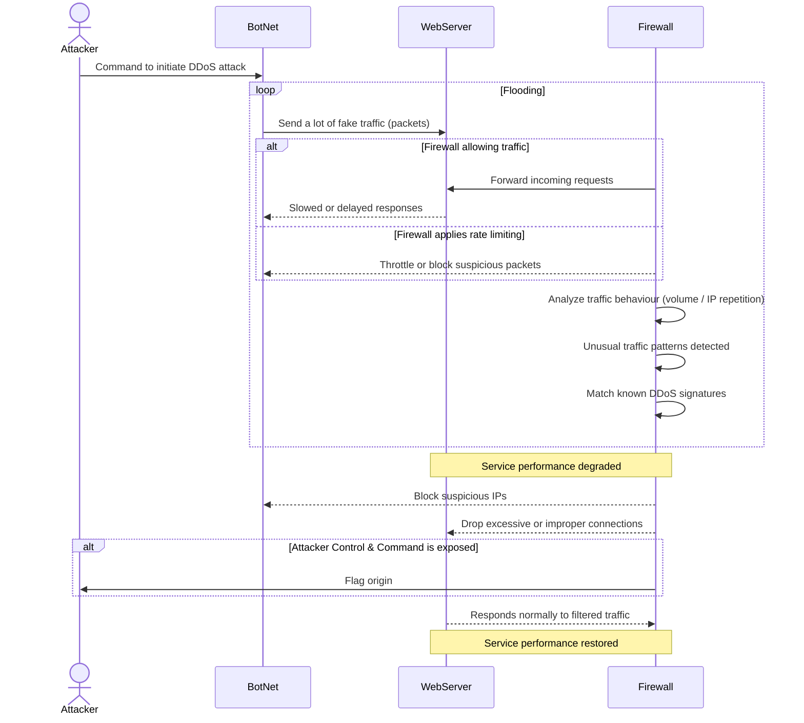

# DDoS Attack Sequence Diagram

## Documentation
The participants of a DDoS attack are the Attacker, which is an actor, and BotNet, WebServer, Firewall, which are participants. This is due to the Attacker being a person while BotNet, WebServer, and Firewall are all processes.

As this assignment indicates that the diagram should highlight the Attacker, BotNet, WebServer, and Firewall, that is all that is displayed. Otherwise, an additional actor "OtherUsers" would be added as well, showing other users' interaction with the WebServer, and Firewall during the attack.

For this assignment, grouping the steps makes more sense to me.

1. The **Attacker** _(Human actor that initiates the DDoS attack by sending commands to the **BotNet**)_ issues a command to the **BotNet** _(distributed network of compromised systems under the **Attacker's** command used to flood the target server, **WebServer** with traffic)_, typically done by use of a Command & Control channel _(C2)_
2. The **BotNet** begins sending a massive amount of fake or repetitive packets to the **WebServer** in an attempt to overwhelm it. The **Firewall** examines each request, and depending on if traffic is allowed or if rate limiting is applied, the **Firewall** forwards the request to the **WebServer**, or it blocks, or throttles traffic from suspicious sources. 
3. At the same time, the **Firewall** performs traffic analysis, attempting to detect unusual traffic behaviour _(in the form of volume spikes or repeated IP addresses)_, and compares the traffic against known DDoS attack patterns or signatures, typically by use of signature databases or behaviour analysis.
4. At this point, the **WebServer**, overwhelmed by the attack traffic, begins to slow down or fail to respond to the **BotNet** packets, as well as other users' packets, though not displayed.
5. Assuming the **Firewall** has detected the anomaly, it attempts to block suspicious IP addresses associated with the **BotNet**, and drops excessive, malformed, or non-compliant traffic to prevent it from reaching the **WebServer**.
6. If the **Attacker's** control infrastructure _(C2)_ is exposed, the **Firewall** flags it. 
7. Once malicious traffic is filtered or blocked, the **Webserver** resumes normal operation, being able to respond filtered traffic.