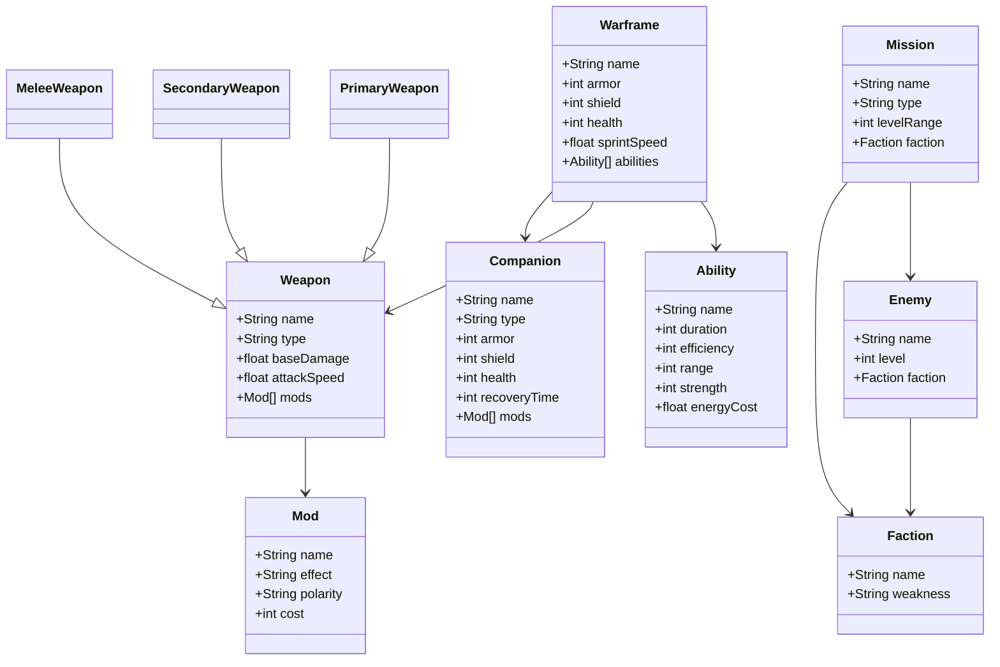

# Warframe Class Diagram

## Documentation
This diagram represents core object-oriented relationships in Warframe's gameplay structure. It includes Warframes and their abilities, various types of weapons, equippable mods, companions, enemies, and missions. Inheritance is used to distinguish weapon types, and associations show how each component interacts within the game.

Warframes each have 4 abilities, each of which have efficiency, which interacts to lower ability cost, strength, determining how strong the ability is, duration, determinig how long they last, and range, determining how far the ability reaches. Additionally, they all have sprint speed, health, shield, armor, and energy, all of which can be influenced by mods.

Mods have a variety of components, including a unique name, effect, and polarity. Every weapon, warframe, and companion has an interface for installing mods, and polarity determines if the cost of the mod will be higher or lower. Matching the polarity of a mod in this interface cuts the cost of a mod in half. By default, the maximum mod capacity is 30, but can be doubled by use of orokin catalysts / reactors, and can be further increased on warframes, and melee weapons by use of aura and stance mods, respectively.

Weapons all have a unique name, and there are several types of weapons, such as rifle, shotgun, pistol, etc. Additionally, they have an attack speed (referred to as fire rate on guns, and attack speed on melee weapons), base damage, and a mod interface.

Companions all have a unique name, and various stats such as armor, shield, health, and recovery time. Additionally, they all have a mod interface as well.

There are a variety of mission types, such as capture, survival, defense, etc. There are too many to really go into much detail into each, but along with that, they all have a level range (in the form of x-y, typically in a range of 5 or 10), faction (which decides the type of enemy that is found in that mission), and unique name of the mission tile, such as Olympus, Mars. (Olympus is the mission name, and it's found on the planet mars. There are many planets in the game.)

As for enemies, there are several factions in the game, such as corpus, grineer, and infested. Each faction has several weakness, such as slash, toxic, or heat. There are a lot of damage types in the game, so each faction typically has 2 weaknesses, except for special faction types, such as kuva grineer, which only has 1. In the game, every enemy is denoted by their name, as well as the level that they are currently at. Endless type missions, such as defense or survival, have the enemies scale up with every milestone passed. 3 waves in defense or 5 minutes passed in survival increases the level of enemies encountered.