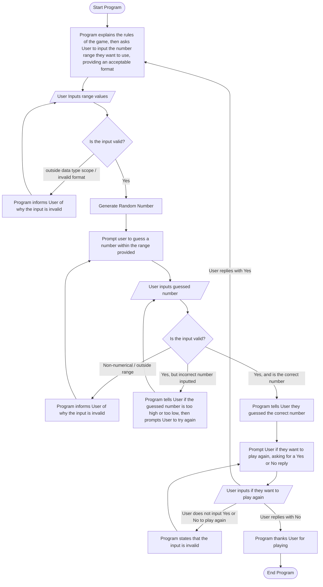

# Guessing Game Flowchart

## Rules
1. All values input must conform to the appropriate prompt. _(i.e. if program propmts for a number, input must be numerical)_
2. Values input after random number generation must be within the selected range _(can be inclusive or exclusive, doesn't change much either way, as long as the distinction is made clear within the program on implementation)_

## Documentation
Anytime you see a lowercase letter, such as "sPrompt", the lowercase is an abbreviation for another word. It's like this for simplicity and to ensure that flowchart edges are more easily identifiable to which part of the flowchart they correspond to.
- s = Start
- r = Range
- g = Guess
- a = Again _(chose "Again" so this format would make more sense, otherwise I would have gone with "r" for "repeat")_
- e = End 

As for explaining the mermaid markdown, it would be easiest to do that line by line:

1. Program starts, explains the rules of the game, then prompts User for a numerical range to start. The implementation of how this range is decided is up to the person implementing the flowchart _(more on this later)_.
2. After prompting User, User inputs the range.
3. After User inputs the range, the program runs a check to ensure that the input is valid. _(This is the reason that I'm leaving the implementation of how the range is decided to the person implementing. Depending on how it is implemented, there is a lot of added complexity to the flowchart that impedes the simplicity of a flowchart. Either User has to input two values separately, in which case validation of the input has to be performed twice, or the range is in one input, by use of delimitation. In which case, text validation needs to be performed to ensure the correct delimiter is used as well as to ensure that the range is numerical. On top of that, validation has to be performed to ensure that the range falls into a form that conforms to how the programmer has their program set up, whether that be "first number is the low end, second number is the high end," or "two numbers provided with the range being between them")_.
4. If the input does not conform to the requested format, or falls outside of the data type range _(i.e. integer typically has a limit at (2^31)-1)_, the program informs User of why their input was invalid.
5. The program then takes User back to the range input step.
6. If User input correctly, the program then generates a number within the request range.
7. The program then prompts User to guess a number within the selected range.
8. After prompting User, User inputs a number.
9. Validation is then performed on the input.
10. If the input is non-numerical or is outside of the range, the program tells User why the input was invalid.
11. The program then propmts User to input a number again.
12. If the input is numerical and within the range, but is not the correct value, the program tells User whether the input was too high or too low, then prompts User to try again.
13. After prompting User, the program waits for input from User again.
14. If the input is numerical, within the range, and is the correct number, the program tells User that they guessed the correct number.
15. The program then asks User if they would like to play again, asking for a "Yes" or "No" _(input can be case-sensitive or not, up to the implementer)_.
16. Program then waits for User to make their choice.
17. If User does not input "Yes" or "No", the program tells User that the incorrect input was given.
18. Program returns to prompting User if they would like to play again, asking for a "Yes" or "No" response.
19. If User inputs "Yes," the program takes them back to prompting for a range, not explaining the rules again since they already played.
20. If User inputs "No," the program thanks them for playing.
21. Program ends.