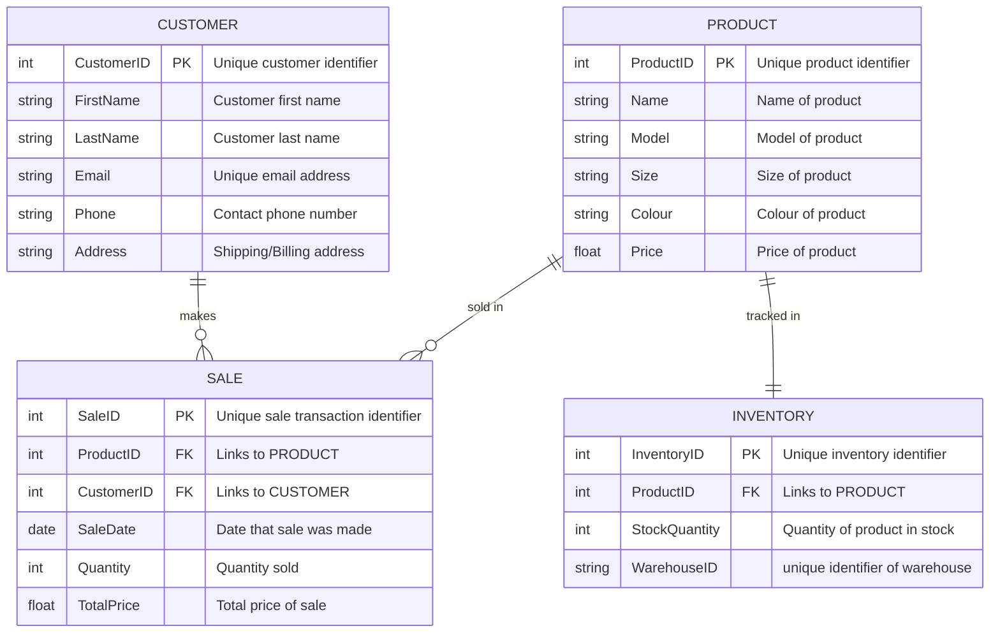

# Nike Store Entity Relationship Diagram

## Documentation

### Entities:
- **PRODUCT**  
    Represents different Nike shoe models sold in the store.  
    Attributes include:
    - `ProductID`: Primary Key uniquely identifying each product.
    - `Name`: The shoe’s commercial name.
    - `Model`: Specific model code or identifier.
    - `Size`: The shoe size.
    - `Colour`: The color description.
    - `Price`: Retail price per unit.
- **CUSTOMER**  
    Contains details about customers.  
    Attributes include:
    - `CustomerID`: Primary Key uniquely identifying each customer
    - `FirstName`: First name of the customer
    - `LastName`: Last name of the customer
    - `Email`: Unique email associated with the customer
    - `Phone`: Phone number associated with the customer
    - `Address`: Shipping / Billing address associated with the customer
- **SALE**  
    Contains details about sales made.  
    Attributes include:
    - `SaleID`: Primary Key uniquely identifying each sale
    - `ProductID`: Foreign Key identifying the attached product
    - `CustomerID`: Foreign Key identifying the attached customer
    - `SaleDate`: Date when the sale occurred
    - `Quantity`: Number of units sold
    - `TotalPrice`: Total cost of the transaction
- **Inventory**  
    Contains details about the inventory availability of products.  
    Attributes include:
    - `InventoryID`: Primary Key uniquely identifying inventory records.
    - `ProductID`: Foreign Key identifying the product.
    - `StockQuantity`: Number of items currently in stock.
    - `WarehouseID`: Identifier of the warehouse storing the product.

### Relationships: 
- **CUSTOMER to SALE (1-to-many):**  
    Each customer can make many sales, while each sale can only be attributed to one customer. This helps the store track who buys what, enabling personalized service, marketing, and loyalty programs.

- **PRODUCT to SALE (1-to-many):**  
    Each sale record represents the purchase of exactly one product. Over time, many sales records can be made for the same product. This allows the business to monitor sales performance of each shoe model and manage pricing or promotions effectively.

- **PRODUCT to INVENTORY (1-to-1):**  
    Each product has one inventory record tracking stock. This is essential for knowing how many shoes are available, preventing stockouts, and managing restocking efficiently.